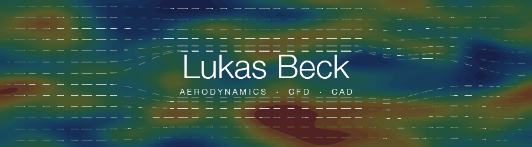

```
Studies  →  BSc Mechanical Engineering, ETH Zürich · 5th semester
Focus    →  Aerodynamics → CFD · aeroshell design / surface modelling
Team     →  aCentauri Solar Racing — Aerodynamics subteam
Compute  →  ANSYS Fluent on the ETH Euler cluster (Slurm)
Tools    →  Python · Siemens NX · PyAnsys
```

<div align="center">


</div>

---

## `What I work on`

```
Aeroshell design
  - Surface modelling of the solar car body
  - Shape iteration between CAD and simulation

CFD
  - RANS simulations of the full car
  - Runs on the ETH Euler cluster (Slurm)
  - Mesh and solver setup
  - Pipeline development for a faster workflow
```

---

## `Repositories`

```
aero_cfd_automation  →  CFD pipeline. Workflow optimisation with
                        PyAnsys / PyFluent.

FinESC               →  Real-time simulator for extremum-seeking control
                        of a morphing wingsail, without a wind sensor.

NXScripts            →  NXOpen journal that builds NACA 4-digit profiles
                        or GT2 pulleys inside Siemens NX.
```
