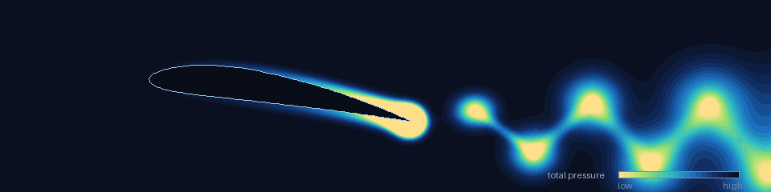

<div align="center">

# Lukas Beck

[](https://github.com/lukbeck12)

</div>

```
Studies  →  BSc Mechanical Engineering, ETH Zürich · 5th semester
Focus    →  Aerodynamics → CFD · aeroshell design / surface modelling
Team     →  aCentauri Solar Racing — Aerodynamics subteam
Compute  →  ANSYS Fluent on the ETH Euler cluster (Slurm)
Tools    →  Python · Siemens NX · PyAnsys
```

<div align="center">


</div>

---

## What I work on

```
Aeroshell design
  Surface modelling of the solar car body, with drag and
  crosswind behaviour as the design driver.

CFD and pipeline workflow
  RANS simulations on the ETH Euler cluster, and the tooling
  around them: mesh and solver setup, job submission, force
  report evaluation. Most of the effort goes into making that
  loop faster and more reproducible to run.
```

---

## Repositories

| Repo | What it is |
|---|---|
| `aero_cfd_automation` | CFD pipeline. Workflow optimisation with PyAnsys / PyFluent. |
| `FinESC` | Real-time simulator for extremum-seeking control of a morphing wingsail, without a wind sensor. |
| `NXScripts` | NXOpen journal that builds NACA 4-digit profiles or GT2 pulleys inside Siemens NX. |
